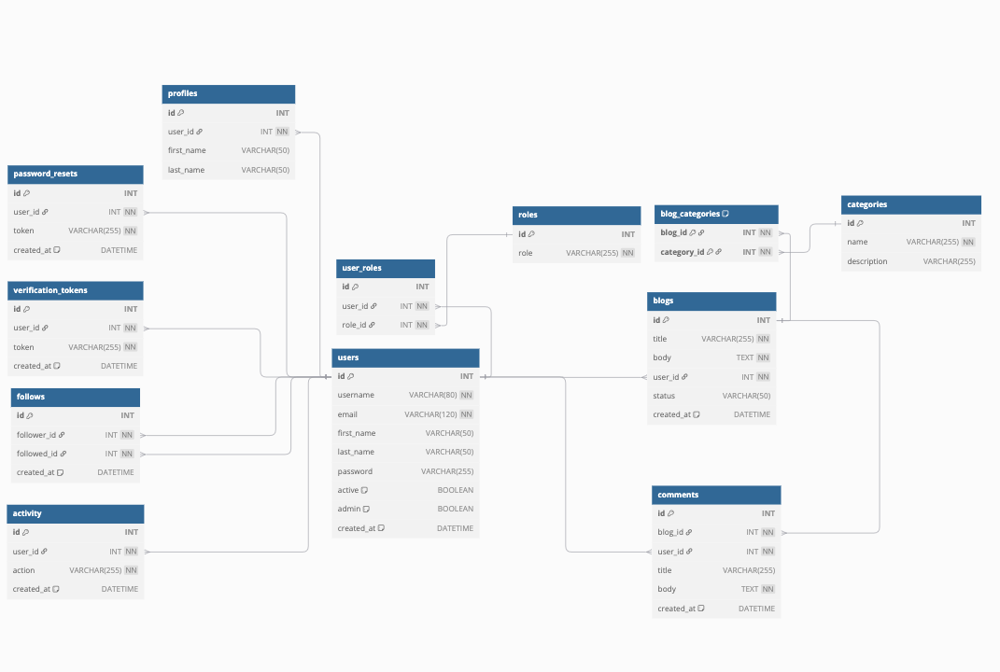

# UNB Multi-User Blog
CS3103 Term Project

## Authors
- **Alex Cameron** *#3680202*
- **Francis Radford** *#3698916*
- **Will Ross** *#3734692*

## Description
This is the flask application for a multiuser blog design to work and use all techniques learned in CS3103. This uses Flask and Mariadb to create our api calls need. Our frontend is using vue.

## Features
- User Registration
- User Login
- User Logout
- User Profile
- User Follow/Unfollow
- User Roles
- User Blog Creation
- User Blog Deletion
- User Blog Update
- User Blog Commenting
- Search Blogs
- Search Comments
- Search Categories


## Setup
This will be running on the `cs3103.cs.unb.ca` server. Our group port is `8023` so to access any api calls you will need the url: `http://cs3103.cs.unb.ca:8023/`. The Database is also hosted on the UNB servers in cs3103. To use the frontend just simply paste the url in your favorite browser and it should work.

To run locally run the following:
1) `cd backend`
2) Note make sure all python files have proper permissions including the routes, use this command `chmod +x *.py` in the routes folder and the backend folder
3) Run the app.py to start the server `python3 app.py` (If on linux or mac), `python app.py` (If on windows)
4) The server should prompt you that it is now running wiht the url `http://cs3103.cs.unb.ca:8023/`


## Project Sturcture 
```
CS3103_MultiUserBlog/

├── backend/
│   ├── db/
│   │   ├── create_tables.sql
│   │   └── create_stored_procedures.sql
│   ├── docs/
│   │   ├── database_design.md
│   │   ├── openapi.yaml
│   │   └── README.md
│   ├── routes/
│   │   ├── activities.py
│   │   ├── admin.py
│   │   ├── auth.py
│   │   ├── blogs.py
│   │   ├── categories.py
│   │   ├── comments.py
│   │   ├── follow.py
│   │   ├── reset.py
│   │   ├── roles.py
│   │   ├── users.py
│   │   └── verify.py
│   ├── script/
│   │   └── permissions.sh
│   ├── tests/
│   │   ├── add_comments.sh
│   │   ├── assign_role.sh
│   │   ├── create_blog.sh
│   │   ├── create_category.sh
│   │   ├── create_role.sh
│   │   ├── create_user.sh
│   │   ├── delete_blog.sh
│   │   ├── delete_category.sh
│   │   ├── delete_comment.sh
│   │   ├── follow_a_user.sh
│   │   ├── get_all_blogs.sh
│   │   ├── get_all_comments.sh
│   │   ├── get_blog.sh
│   │   ├── get_categories.sh
│   │   ├── get_followers.sh
│   │   ├── list_roles.sh
│   │   ├── login.sh
│   │   ├── submit_token_request.sh
│   │   ├── unfollow_a_user.sh
│   │   ├── update_category.sh
│   │   ├── update_comment.sh
│   │   ├── verify.sh
│   │   ├── view_all_comments_on_blog.sh
│   │   ├── view_logs.sh
│   │   └── whoami.sh
│   ├── utils/
│   │   ├── db_util.py
│   │   └── email_util.py
│   ├── app.py
│   └── settings.py
|
├── frontend/
│   ├── css/
│   │   └── styles.css
│   ├── images/
│   │   ├── banners/
│   │   │   ├── banner-1.jpg
│   │   │   ├── banner-2.jpg
│   │   │   ├── banner-3.jpg
│   │   │   ├── banner-4.jpg
│   │   │   ├── banner-5.jpg
│   │   │   ├── banner-6.jpg
│   │   │   ├── banner-7.jpg
│   │   │   ├── banner-8.jpg
│   │   │   ├── banner-9.jpg
│   │   │   └── banner-10.jpg
│   │   └── uploads/
│   │       ├── logo.ico
│   │       └── logo.png
│   ├── js/
│   │   ├── components/
│   │   │   ├── blog-card.js
│   │   │   ├── blog-post.js
│   │   │   ├── feature.js
│   │   │   ├── login-modal.js
│   │   │   └── sidebar.js
│   │   ├── pages/
│   │   │   ├── create-post.js
│   │   │   ├── home.js
│   │   │   └── profile.js
│   │   └── main.js
│   ├── index.html
│   ├── LICENSE
│   └── README.md
└── .gitignore


```


## Database
The Database was done on mariadb with out cs3103 server.

### UML Design 



### Tables and Stored Procedures
All sql code used is in `/backend/db/` folder the `create_tables.sql` file was used to create the tables and the `create_stored_procedures.sql` was used to create the stored procedures.


## Routes
For our sanity and yours we split up all the routes into designated files. This way for changes or grading everyone can simply go to that specific file and see the routes. All these route files are exporting the specific route to the app.py file. This way when you run the app.py you have access to all of them.

**Note** Below we have each file and the types of requests it is very similar to the openapi.yaml in the docs folder.

### /activities
This was used for routes that would keep track of activities done by the user. This was used for logging in and out of the system.

### /admin
This is our admin routes, used for management of the system.

### /auth
This is the signin / signout endpoints and session manager

### /blogs
This is all the CRUD operations for the blogs.


### /categories
This is all the CRUD operations for the categories.

### /comments
This is all the CRUD operations for the comments.


### /follow
This allows the user to follow/unfollow other users. They can also get a list of who there following and who is following them.


### /reset
This is the reset password route. That sends the request to their email and allows them to reset their password.

### /roles
Role Management CRUD opertaions.

### /users
Users can create an account, get info, update or even delete their account.

### /verify
This route allows for verification of emails on signup.


## Running Tests

1) Go to the `tests` directory `cd backend/tests`
2) Make sure you have proper permissions just run this command `chmod +x *.sh`
3) Run any of the following tests in there. Note, most of the tests do require the user to be logged in, so the following tests should be done first 

    - `./create_user.sh` - This will create a user in the database
    - `./login.sh` - This will login the user and create a token for the user
    - `./whoami.sh` - This will get the user information from the token, (this is also optional) 
    - `./verify.sh` - This will verify the user and send a email to the user
    - `./submit_token_request.sh` - This will submit a token request to the server

4) After all thoses are done feel free to test any of them, we just have to make sure your cookie jar is created otherwise it wont allow you to do anything without account credentials.


## If your lazy we don't blame you lol
I put a video in the repo its call `CS3103_Video.mp4`. Its a demo of the application.


